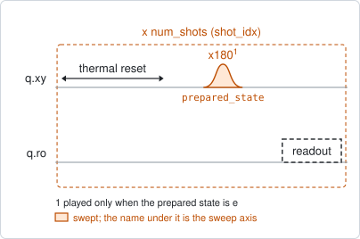
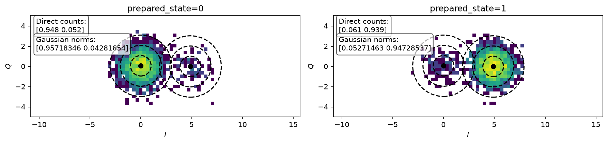

# single_shot_readout

## Purpose

Measures how well one readout shot tells the two qubit states apart. The qubit is
prepared in its ground state and in its excited state, every shot is recorded,
and the two clouds of points in the I/Q plane are fitted.

It gives the assignment fidelity of each state, and the centres of the two
clouds. The centres are the reference other experiments use to turn an averaged
I/Q point into a population, and they are what a discriminator is calibrated
from.

Run it after the readout frequency and power are chosen, and again whenever
either changes.

```
scqo run single_shot_readout --targets q1
scqo run single_shot_readout --targets q1 --set num_shots=10000
```

## Before running it

<!-- BEGIN generated: requires -->
GENERATED from `SingleShotReadout.requires` and its Parameters mixins - edit
the declaration, then run `python scripts/update_docs.py`.

The target is a `transmon` / `flux_transmon` / `fluxonium` carrying the operations `readout`.

These device values must already be right:

| value | held by | used for | provided by |
|---|---|---|---|
| `readout_freq_hz` | readout channel | the readout tone has to sit on the resonator | `readout_frequency`, `resonator_spectroscopy`, `resonator_spectroscopy_flux`, `resonator_spectroscopy_power_amp`, `resonator_spectroscopy_power_chain` |
| `readout_power_dbm` | readout channel | the readout has to be at its working power | `resonator_spectroscopy_power_amp`, `resonator_spectroscopy_power_chain` |
| `drive_freq_hz` | drive channel | the x180 that prepares \|e> has to be on resonance | `qubit_ramsey`, `qubit_ramsey_flux_pulse`, `qubit_ramsey_phasor`, `qubit_spectroscopy` |
| `pi_amp` | drive channel | the x180 that prepares \|e> has to be a full pi pulse | `qubit_deterministic_benchmarking`, `qubit_pi_pulse_error`, `qubit_power_rabi` |
| `thermalization_time_s` | drive channel | how long the thermal reset waits (a per-run thermalization_time_ns replaces it) (with the default `reset_method=thermal`) | `qubit_relaxation` |

Needed only with a non-default setting:

| setting | value | held by | used for | provided by |
|---|---|---|---|---|
| `reset_method=active` | `readout_rotation_rad` | readout channel | the reset measurement is discriminated on the rotated axis | no shared experiment; set it by hand (`scqo set`) or by a backend's own writeback |
| `reset_method=active` | `readout_threshold` | readout channel | decides whether the reset plays its pi pulse | no shared experiment; set it by hand (`scqo set`) or by a backend's own writeback |
| `reset_method=active` | `readout_depletion_s` | readout channel | the settle between the reset measurement and the first pulse | `resonator_spectroscopy` |

A backend may need more than this - a knob only it consumes. `scqo run single_shot_readout --help` lists those where that driver is installed.
<!-- END generated: requires -->

## Pulse sequence



Each shot is a reset, then the state preparation, then one readout. The
preparation is nothing for the ground state and an `x180` for the excited state.
Every shot is kept, so the shot index is an axis of the dataset.

## Theory

*To be written.*

## Outputs

<!-- BEGIN generated: outputs -->
GENERATED from `SingleShotReadout.writes` and `.extracts` - edit the
declaration, then run `python scripts/update_docs.py`.

Proposed by `update()`; each stays pending until it is accepted:

| field | held by | role | unit | meaning |
|---|---|---|---|---|
| `fidelity_g` | readout channel | monitor | - | P(assign g \| prepared g) — monitor of the CURRENT readout settings. |
| `fidelity_e` | readout channel | monitor | - | P(assign e \| prepared e). |
| `pos_g_i` | readout channel | monitor | - | \|g> blob center, I (acquisition frame). |
| `pos_g_q` | readout channel | monitor | - | \|g> blob center, Q. |
| `pos_e_i` | readout channel | monitor | - | \|e> blob center, I. |
| `pos_e_q` | readout channel | monitor | - | \|e> blob center, Q. |

Reported in `result.fit` and never written:

| fit key | meaning |
|---|---|
| `readout_fidelity` | the mean of the two per-state fidelities |
| `assign_e_prep_g` | COUNTED: the fraction of \|g>-prepared shots assigned \|e> (thermal population plus blob overlap) |
| `assign_g_prep_e` | COUNTED: the fraction of \|e>-prepared shots assigned \|g> (decay during readout plus blob overlap) |
| `pop_e_prep_g` | FITTED: the weight of the \|e> blob in the \|g>-prepared shots, with the overlap removed |
| `pop_g_prep_e` | FITTED: the weight of the \|g> blob in the \|e>-prepared shots |
| `outlier_probability` | the fraction of shots belonging to neither blob |
| `mean_g_i` | the \|g> blob centre, I (stored as pos_g_i) |
| `mean_g_q` | the \|g> blob centre, Q (stored as pos_g_q) |
| `mean_e_i` | the \|e> blob centre, I (stored as pos_e_i) |
| `mean_e_q` | the \|e> blob centre, Q (stored as pos_e_q) |
<!-- END generated: outputs -->

The cloud centres are stored only when all four are finite.

The confusion numbers are kept in the run record and not as device values,
because they depend on the instrument as much as on the chip. The two pairs
answer different questions: the `assign_*` values count how many shots landed on
the wrong side, and the `pop_*` values are the weights of the fitted clouds,
which removes the overlap between them and leaves the population that really was
in the other state.

A run is `SUCCESSFUL` when the fidelity is a number above 0.5.

## Expected result



One panel per preparation: the shots as a histogram in the I/Q plane, with the
two fitted clouds drawn as contours. Each box gives the counted fractions and
the weights of the fitted clouds. Check that:

- there are two clouds, each roughly round, and each preparation falls mostly on
  its own cloud;
- the clouds are separated by several times their width. Clouds that overlap
  give a fidelity limited by the readout, not by the qubit;
- a tail of excited-state shots towards the ground-state cloud is decay during
  the readout, and a small ground-state population on the excited cloud is the
  thermal population.

## Traps

- **The discriminator is not set by this experiment in the core.** The centres
  and fidelities are stored; the rotation and threshold that state discrimination
  uses are proposed by the driver, in its own convention. After accepting them,
  run again to confirm.
- **Stale centres.** The stored centres move with the readout frequency, the
  readout power and the cabling. Any experiment that reads populations from
  averaged I/Q uses them, so re-run this one after changing the readout.
- **A fidelity near 0.5.** The two preparations look the same: the excited state
  was not prepared (drive off resonance, wrong pi amplitude) or the readout does
  not distinguish the states at this frequency and power.

## References

- Related experiments: `readout_frequency` and `readout_power` (choose the point
  this one characterizes), `qubit_thermal_population` (uses the centres stored
  here), `readout_time_of_flight`.
- Code: `scqo/experiments/single_shot_readout.py`,
  `scqat/estimators/state_discrimination/`.
